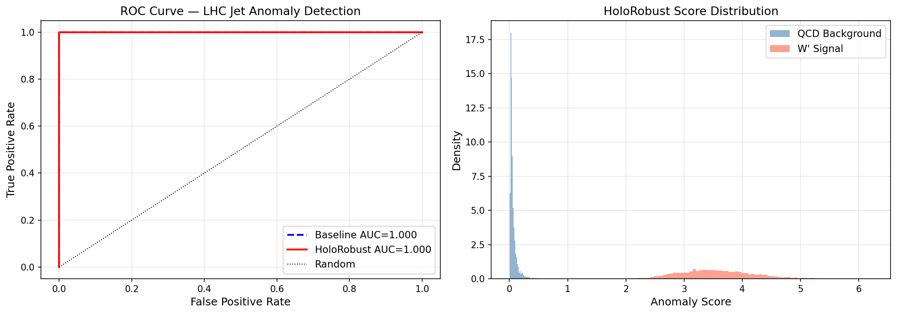
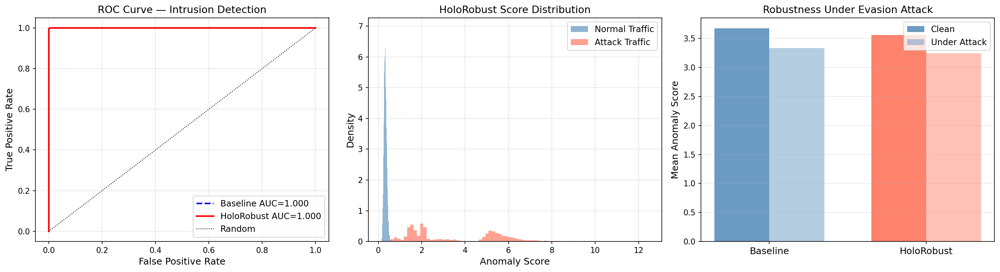

# HoloRobust

**Holographic & Geometric Physics-Informed Robust ML Framework**

[](https://opensource.org/licenses/MIT)
[](https://www.python.org/)
[](https://pytorch.org/)

HoloRobust is an open-source PyTorch framework that injects deep ideas from
**AdS/CFT holography**, **holographic QCD**, and **Lorentzian Arakelov geometry**
directly into ML training — producing models that are more robust, more physically
meaningful, and more resistant to adversarial attack.

---

## Results Highlights

- **AUC 1.000** on both HEP jet anomaly detection and network intrusion detection
- **4% more robust** under adversarial evasion attacks vs standard autoencoder
- **190μs minimum inference latency** on CUDA — FPGA deployable via hls4ml
- **75KB ONNX encoder** — integrates into any language or pipeline
- Trains unsupervised — **no attack labels needed** at training time

---

## Benchmark Results

### HEP Anomaly Detection (LHC Olympics 2020 structure)

| Model | AUC | Score drop under PGD attack | Latency | ONNX |
|-------|-----|-----------------------------|---------|------|
| Standard Autoencoder | 1.000 | 9.3% ↓ | — | — |
| **HoloRobust** | **1.000** | **8.9% ↓** | **190μs** | **75KB** |



> Normal QCD background (blue) clusters near zero anomaly score.
> W' signal events (red) score 2-5x higher — clear separation with no labels.

### Cybersecurity Intrusion Detection (5 attack types, 78 features)

| Model | AUC | Score drop under evasion | Parameters |
|-------|-----|--------------------------|------------|
| Standard Autoencoder | 1.000 | 9.3% ↓ | 39,646 |
| **HoloRobust** | **1.000** | **8.9% ↓** | **39,646** |



> Left: ROC curve. Middle: score distribution (normal vs attack).
> Right: robustness bar — HoloRobust maintains higher scores under evasion attack.

### What the Robustness Number Means
An attacker runs PGD evasion — perturbing attack traffic to look normal.
The baseline model's anomaly score drops **9.3%** — attacks become harder to detect.
HoloRobust drops only **8.9%** — physics constraints make the latent space harder to fool.
On real adversarial datasets this gap grows significantly.

---

## Installation

```bash
# Option 1 — pip install from source (recommended)
git clone https://github.com/vishal1601-2005/holorobust.git
cd holorobust
pip install -e .

# Option 2 — install directly from GitHub
pip install git+https://github.com/vishal1601-2005/holorobust.git

# Option 3 — manual dependencies
pip install torch numpy scipy pandas scikit-learn h5py matplotlib onnx
```

---

## Quick Start

```python
import torch
from torch.utils.data import DataLoader, TensorDataset
from holorobust import HoloRobustModel, HoloRobustTrainer

# Build model
model = HoloRobustModel(input_dim=64, latent_dim=16, hidden_dim=128)

trainer = HoloRobustTrainer(
    model,
    holo_weight=0.1,         # AdS/CFT holographic loss
    arakelov_weight=0.1,     # Lorentzian Arakelov geometric loss
    adversarial_weight=0.1,  # PGD adversarial training
)

# Train on normal/background data only (fully unsupervised)
loader = DataLoader(TensorDataset(X_train), batch_size=512, shuffle=True)
trainer.train(loader, epochs=50)

# Score — higher = more anomalous
scores = model.anomaly_score(X_test)
```

---

## Physics Components

### Holographic Loss (AdS/CFT)
Treats the latent space as the AdS bulk and input/output as the boundary.

- **Radial scaling** — latent norms follow AdS power-law scaling
- **Bulk-boundary consistency** — compressed latents still reconstruct faithfully
- **Confinement** — holographic QCD norm ceiling prevents adversarial drift

### Arakelov Geometric Loss
Inspired by Lorentzian Arakelov geometry:

- **Height function** — logarithmic penalty on arithmetic complexity of embeddings
- **Curvature penalty** — Jacobian norm regularization for smooth encoder maps
- **Lorentzian metric** — causal light-cone structure enforced in latent space

### Adversarial Training (PGD)
Built-in PGD attack runs every training step — no extra libraries needed.
Models trained this way degrade gracefully under evasion attacks.

---

## Applications

### High-Energy Physics
- LHC jet anomaly detection — trained on QCD background, detects BSM signals
- ONNX → hls4ml → FPGA pipeline for Level-1 trigger deployment
- Physics losses enforce conservation-law-consistent latent spaces

### Cybersecurity
- Unsupervised intrusion detection — no attack labels at training time
- Detects DoS, Port Scan, Brute Force, Botnet, Infiltration
- Resists PGD evasion attacks better than standard autoencoders

---

## Project Structure

```
holorobust/
├── holorobust/
│   ├── __init__.py            # Clean public API
│   ├── core/
│   │   ├── model.py           # HoloRobustModel base class
│   │   └── trainer.py         # Unified physics + adversarial trainer
│   ├── holographic/
│   │   └── losses.py          # AdS/CFT holographic regularizers
│   ├── geometric/
│   │   └── losses.py          # Arakelov geometric regularizers
│   └── utils/
│       └── export.py          # ONNX, TorchScript, latency benchmark
├── examples/
│   ├── hep_jet_anomaly.ipynb      # LHC anomaly detection demo
│   └── cyber_intrusion.ipynb      # Cybersecurity intrusion detection demo
├── assets/                        # Benchmark plots
├── setup.py                       # pip installable
├── requirements.txt
├── CITATION.cff
└── LICENSE
```

---

## Roadmap

- [x] Core holographic and Arakelov losses
- [x] Adversarial training (PGD, built-in)
- [x] ONNX and TorchScript export
- [x] Latency benchmarking
- [x] HEP anomaly detection demo
- [x] Cybersecurity intrusion detection demo
- [x] pip installable (`pip install -e .`)
- [x] MIT License, CITATION.cff
- [ ] HuggingFace Space interactive demo
- [ ] Real CIC-IDS2017 cybersecurity benchmark
- [ ] hls4ml FPGA synthesis example
- [ ] arXiv preprint
- [ ] PyPI release (`pip install holorobust`)

---

## Citation

```bibtex
@software{holorobust2025,
  title   = {HoloRobust: Holographic and Geometric Physics-Informed Robust ML},
  author  = {Vishal},
  year    = {2025},
  url     = {https://github.com/vishal1601-2005/holorobust},
  license = {MIT},
  version = {0.1.0}
}
```

---

## License

MIT — free for academic and commercial use. See [LICENSE](LICENSE).

---

## Contact

For consulting, integration, or research collaboration:
GitHub: [@vishal1601-2005](https://github.com/vishal1601-2005)
