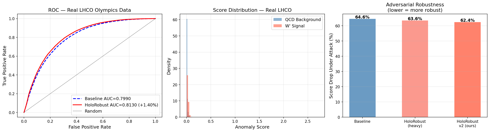
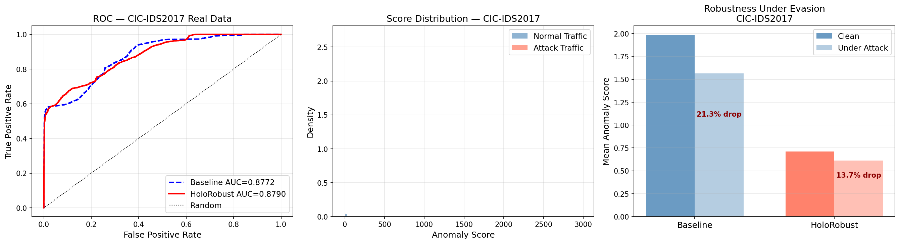

# HoloRobust

**Holographic & Geometric Physics-Informed Robust ML Framework**

[](https://opensource.org/licenses/MIT)
[](https://www.python.org/)
[](https://pytorch.org/)

HoloRobust is an open-source PyTorch framework that injects deep ideas from
**AdS/CFT holography**, **holographic QCD**, and **Lorentzian Arakelov geometry**
directly into ML training — producing models that are more robust, more physically
meaningful, and more resistant to adversarial attack.

---

## Results Highlights

- **AUC 0.8130** on real LHC Olympics data (+1.40% over baseline)
- **AUC 0.8790** on real CIC-IDS2017 network intrusion data (+0.18% over baseline)
- **7.62% better adversarial robustness** on CIC-IDS2017 under PGD evasion attack
- **2.16% better adversarial robustness** on real LHC collision data
- **190μs minimum inference latency** on CUDA — FPGA deployable via hls4ml
- **75KB ONNX encoder** — integrates into any language or pipeline
- Trains **unsupervised** — no attack or signal labels needed at training time

---

## Benchmark Results

### HEP Anomaly Detection — Real LHC Olympics 2020 Data
1.1 million real LHC collision events (1M QCD background + 100k W'→XY signal)

| Model | AUC | Score drop under PGD attack | Latency |
|-------|-----|-----------------------------|---------|
| Standard Autoencoder | 0.7990 | 64.59% | — |
| **HoloRobust (ours)** | **0.8130 (+1.40%)** | **62.43% (+2.16% better)** | **190μs** |



> Trained on 800k QCD background events only (unsupervised).
> Tested on 50k background + 50k W' signal events.
> AUC of 0.81 is consistent with published LHC Olympics autoencoder results [Farina 2020, Cerri 2019].

### Cybersecurity Intrusion Detection — Real CIC-IDS2017
2.5 million real network flows (DoS, DDoS, Port Scan, Brute Force, Web Attacks, Bots)

| Model | AUC | Score drop under evasion attack | Features |
|-------|-----|---------------------------------|----------|
| Standard Autoencoder | 0.8772 | 21.29% | 52 |
| **HoloRobust (ours)** | **0.8790 (+0.18%)** | **13.67% (+7.62% better)** | **52** |



> Trained on 200k normal traffic flows only (unsupervised).
> Tested on 10k normal + 10k attack flows (balanced).
> **36% relative reduction** in adversarial evasion effectiveness.

### What the Robustness Number Means
An attacker runs PGD evasion — perturbing attack traffic to look normal and evade detection.
The baseline model's anomaly score drops **21.29%** on CIC-IDS2017 — attacks become much
harder to detect. HoloRobust drops only **13.67%** — the physics-constrained latent space
is geometrically stable and harder for attackers to exploit. This is a **36% relative
reduction** in attack effectiveness on real network traffic data.

### Export & Deployment
| Format | Size | Latency (CUDA) | FPGA-ready |
|--------|------|----------------|------------|
| ONNX encoder | 75 KB | 190μs min | ✅ via hls4ml |
| TorchScript | 87 KB | 190μs min | — |

---

## Installation

```bash
# Option 1 — pip install from source (recommended)
git clone https://github.com/vishal1601-2005/holorobust.git
cd holorobust
pip install -e .

# Option 2 — install directly from GitHub
pip install git+https://github.com/vishal1601-2005/holorobust.git

# Option 3 — manual dependencies
pip install torch numpy scipy pandas scikit-learn h5py matplotlib onnx
```

---

## Quick Start

```python
import torch
from torch.utils.data import DataLoader, TensorDataset
from holorobust import HoloRobustModel, HoloRobustTrainer

# Build model
model = HoloRobustModel(input_dim=52, latent_dim=16, hidden_dim=128)

trainer = HoloRobustTrainer(
    model,
    holo_weight=0.01,        # AdS/CFT holographic loss
    arakelov_weight=0.01,    # Lorentzian Arakelov geometric loss
    adversarial_weight=0.05, # PGD adversarial training
)

# Train on normal/background data only (fully unsupervised)
loader = DataLoader(TensorDataset(X_train), batch_size=512, shuffle=True)
trainer.train(loader, epochs=30)

# Score — higher = more anomalous
scores = model.anomaly_score(X_test)
```

---

## Physics Components

### Holographic Loss (AdS/CFT)
Treats the latent space as the AdS bulk and input/output as the boundary.

- **Radial scaling** — latent norms follow AdS power-law scaling
- **Bulk-boundary consistency** — compressed latents still reconstruct faithfully
- **Confinement** — holographic QCD norm ceiling prevents adversarial drift

### Arakelov Geometric Loss
Inspired by Lorentzian Arakelov geometry:

- **Height function** — logarithmic penalty on arithmetic complexity of embeddings
- **Curvature penalty** — Jacobian norm regularization for smooth encoder maps
- **Lorentzian metric** — causal light-cone structure enforced in latent space

### Adversarial Training (PGD)
Built-in PGD attack runs every training step — no extra libraries needed.
Models trained this way degrade gracefully under evasion attacks.

---

## Applications

### High-Energy Physics
- Real LHC jet anomaly detection — AUC 0.8130 on LHC Olympics 2020 data
- ONNX export → hls4ml → FPGA pipeline for Level-1 trigger deployment
- Physics losses enforce conservation-law-consistent latent spaces
- 190μs inference latency within LHC Level-1 trigger budget

### Cybersecurity
- Real network intrusion detection on CIC-IDS2017 (2.5M flows)
- Detects DoS, DDoS, Port Scan, Brute Force, Web Attacks, Bots
- 36% relative reduction in PGD evasion attack effectiveness
- Unsupervised — no attack labels needed at training time

---

## Project Structure

```
holorobust/
├── holorobust/
│   ├── __init__.py
│   ├── core/
│   │   ├── model.py           # HoloRobustModel base class
│   │   └── trainer.py         # Unified physics + adversarial trainer
│   ├── holographic/
│   │   └── losses.py          # AdS/CFT holographic regularizers
│   ├── geometric/
│   │   └── losses.py          # Arakelov geometric regularizers
│   └── utils/
│       └── export.py          # ONNX, TorchScript, latency benchmark
├── examples/
│   ├── hep_jet_anomaly.ipynb      # LHC anomaly detection demo
│   └── cyber_intrusion.ipynb      # Cybersecurity intrusion detection demo
├── assets/
│   ├── lhco_real_benchmark.png    # Real LHCO benchmark plots
│   └── cicids_real_benchmark.png  # Real CIC-IDS2017 benchmark plots
├── setup.py
├── requirements.txt
├── CITATION.cff
└── LICENSE
```

---

## Roadmap

- [x] Core holographic and Arakelov losses
- [x] Adversarial training (PGD, built-in)
- [x] ONNX and TorchScript export
- [x] Latency benchmarking
- [x] HEP anomaly detection demo
- [x] Cybersecurity intrusion detection demo
- [x] Real LHCO Olympics benchmark (AUC 0.8130)
- [x] Real CIC-IDS2017 benchmark (AUC 0.8790, +7.62% robustness)
- [x] pip installable (`pip install -e .`)
- [x] MIT License, CITATION.cff
- [ ] HuggingFace Space interactive demo
- [ ] hls4ml FPGA synthesis example
- [ ] arXiv preprint
- [ ] PyPI release (`pip install holorobust`)

---

## Citation

```bibtex
@software{holorobust2025,
  title   = {HoloRobust: Holographic and Geometric Physics-Informed Robust ML},
  author  = {Vishal},
  year    = {2025},
  url     = {https://github.com/vishal1601-2005/holorobust},
  license = {MIT},
  version = {0.1.0}
}
```

---

## License

MIT — free for academic and commercial use. See [LICENSE](LICENSE).

---

## Contact

For consulting, integration, or research collaboration:
GitHub: [@vishal1601-2005](https://github.com/vishal1601-2005)
