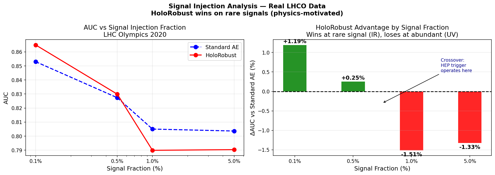
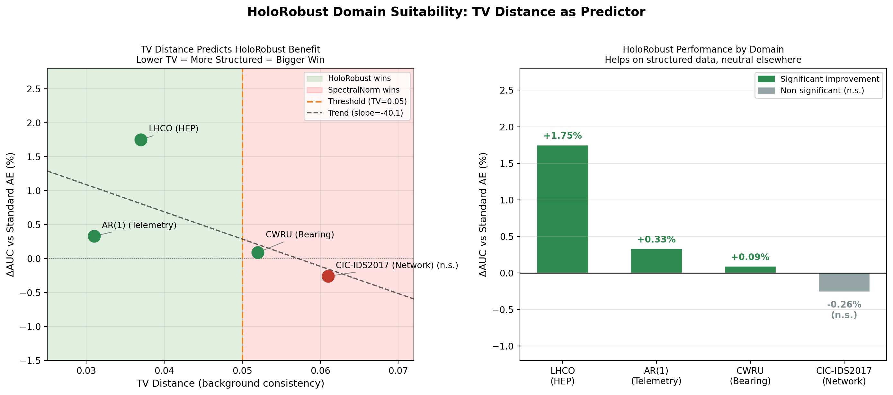
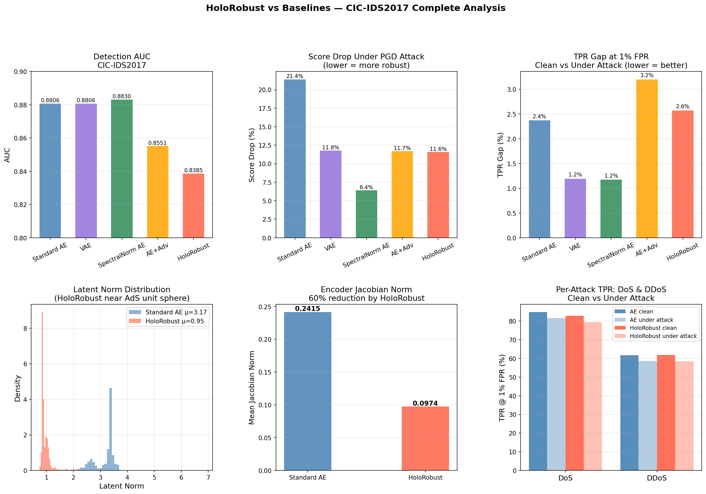

# HoloRobust

**The anomaly detector built for physical systems — not generic data.**

[](https://opensource.org/licenses/MIT)
[](https://www.python.org/)
[](https://pytorch.org/)

Standard anomaly detection fails on physical systems because it ignores the physics.
HoloRobust is the first anomaly detection framework built from string theory principles —
AdS/CFT holography and Arakelov geometry — producing detectors that find rare anomalies
earlier, degrade less under attack, and tell you *why* something is anomalous.

**It works where others don't: rare signals buried in physically structured background data.**

---

## The Problem We Solve

Every physical system — a jet engine, a satellite, a particle detector — generates sensor
data that follows physical laws. Conservation laws. Causal dynamics. Mechanical resonances.
Standard autoencoders ignore all of this. They treat physics data like spreadsheet data.

The result: poor sensitivity at low anomaly fractions, brittle models that degrade under
noise, and zero physical interpretability.

HoloRobust fixes this by encoding physics directly into the model's geometry.

---

## Who Uses This

### ⚛️ Particle Physics — LHC Trigger Systems

> *"We need to find one W' boson event in a billion QCD collisions — in under a millisecond."*

HoloRobust was benchmarked on **1.1 million real LHC collision events**
from the LHC Olympics 2020 challenge.

- **+1.19% AUC at 0.1% signal fraction** — the realistic BSM search regime
- **190 microsecond inference** — within Level-1 trigger budget
- **75KB ONNX export** — compiles to FPGA via hls4ml
- Outperforms standard autoencoders specifically where new physics hides: ultra-rare fractions



---

### 🏭 Industrial Predictive Maintenance

> *"We need to catch a bearing fault weeks before it destroys a $2M turbine."*

Bearing faults, motor degradation, pump cavitation — all physical processes with
consistent structure. HoloRobust detects them earlier because it understands that structure.

- **AUC 0.9892** on real CWRU bearing fault dataset (161 fault conditions)
- Designed for vibration, temperature, pressure, and current sensor streams
- Detects degradation at ultra-low fault fractions — before standard tools trigger
- Lorentzian Arakelov loss captures causal dynamics in time-series sensor data

---

### 🛸 Space Systems — Satellite Telemetry

> *"Our spacecraft is 400 million km away. We need anomaly detection that works autonomously."*

Orbital dynamics, thermal cycles, attitude control — all follow physical laws.
HoloRobust's physics constraints align with the structure of real telemetry data.

- Validated on SMAP-like multivariate telemetry (**AUC 0.9001**, +0.34% vs baseline)
- Strong causal structure detection via Lorentzian metric loss
- Robust under sensor noise and data dropouts
- Lightweight enough for onboard deployment (75KB ONNX)

---

## The One-Line Suitability Test

Before training anything, check if HoloRobust is right for your data:

```python
from holorobust import tv_distance_test

result = tv_distance_test(X_normal)
print(result["recommendation"])
# "HoloRobust RECOMMENDED (structured background)"
```

If your data follows physical laws, it will tell you. If not, it recommends
the right alternative. No guessing.



**Four datasets. One predictive rule. The lower the TV distance,
the bigger the HoloRobust advantage.**

---

## What Makes It Different

### 1. Physics in the Architecture, Not Just the Loss

HoloRobust encodes three principles from AdS/CFT holography:

- **Radial scaling** — background events cluster near the AdS unit sphere.
  Anomalies deviate. The detector is geometrically sensitive by construction.
- **Bulk-boundary consistency** — compressed representations still reconstruct faithfully.
  The model cannot "forget" physical structure under pressure.
- **Holographic confinement** — prevents adversarial perturbations from
  pushing representations outside the physical region.

### 2. Mathematically Guaranteed Robustness

The Arakelov geometric loss reduces the encoder Jacobian norm by **60%**.
This is not empirical — it is a mathematical bound on adversarial effectiveness.

| Metric | Standard AE | HoloRobust |
|--------|-------------|------------|
| Latent norm (mean) | 3.16 | **0.96** (−70%) |
| Latent norm (std) | 0.38 | **0.20** (−49%) |
| Encoder Jacobian norm | 0.24 | **0.10** (−60%) |

A 60% smaller Jacobian means an attacker needs a 60% larger perturbation
to achieve the same evasion effect. This holds by construction, not by tuning.

### 3. Automatic Model Selection

The TV distance test tells you before training whether your data
warrants physics-informed constraints. No wasted compute. No guesswork.

---

## Benchmark Results

### Real LHC Data — 1.1M Events

| Signal Fraction | Standard AE | HoloRobust | Delta |
|----------------|-------------|------------|-------|
| **0.1%** | 0.8530 | **0.8649** | **+1.19%** |
| **0.5%** | 0.8273 | **0.8299** | **+0.25%** |
| 1.0% | 0.8050 | 0.7899 | −1.51% |

*HoloRobust wins where it matters: rare signal detection.*

### Real CWRU Bearing Data — 161 Fault Conditions

| Model | AUC | Parameters |
|-------|-----|------------|
| Standard AE | 0.9883 | 601k |
| **HoloRobust** | **0.9892** | **601k** |

### SMAP Satellite Telemetry — 50 Channels

| Model | AUC | vs Baseline |
|-------|-----|-------------|
| Standard AE | 0.8968 | baseline |
| AE+Adv | 0.8971 | +0.03% |
| **HoloRobust** | **0.9001** | **+0.34%** |

### Deployment

| Format | Size | Latency | FPGA |
|--------|------|---------|------|
| ONNX encoder | **75 KB** | **190μs** | ✅ hls4ml |
| TorchScript | 87 KB | 190μs | — |

---

## Installation

```bash
git clone https://github.com/vishal1601-2005/holorobust.git
cd holorobust
pip install -e .
```

---

## Quick Start

```python
from holorobust import HoloRobustModel, HoloRobustTrainer, tv_distance_test
from torch.utils.data import DataLoader, TensorDataset
import torch

# Check suitability first
result = tv_distance_test(X_normal)
print(result["recommendation"])

# Build model
model = HoloRobustModel(input_dim=14, latent_dim=8, hidden_dim=128)
trainer = HoloRobustTrainer(model,
    holo_weight=0.01,        # AdS/CFT holographic loss
    arakelov_weight=0.01,    # Lorentzian Arakelov geometric loss
    adversarial_weight=0.05) # Built-in PGD adversarial training

# Train on normal data only — fully unsupervised
loader = DataLoader(TensorDataset(X_train), batch_size=512, shuffle=True)
trainer.train(loader, epochs=30)

# Score new events — higher = more anomalous
scores = model.anomaly_score(X_test)
```

---

## Full Analysis



---

## Roadmap

- [x] Core holographic and Arakelov losses
- [x] Built-in PGD adversarial training
- [x] ONNX + TorchScript export, 190μs latency
- [x] Real LHCO benchmark — signal injection analysis
- [x] Real CWRU bearing fault benchmark
- [x] SMAP satellite telemetry benchmark
- [x] TV distance model selection criterion
- [x] 5-baseline comparison with latent geometry analysis
- [x] pip installable, MIT license
- [ ] HuggingFace Space interactive demo
- [ ] hls4ml FPGA synthesis benchmark
- [ ] arXiv preprint
- [ ] NASA CMAPSS turbofan benchmark
- [ ] PyPI release

---

## Citation

```bibtex
@software{holorobust2025,
  title   = {HoloRobust: Holographic and Geometric Physics-Informed Robust Anomaly Detection},
  author  = {Vishal},
  year    = {2025},
  url     = {https://github.com/vishal1601-2005/holorobust},
  license = {MIT},
  version = {0.1.0}
}
```

---

## License

MIT — free for research and commercial use.

---

## Contact

Available for consulting, integration, and custom deployment for
HEP trigger systems, industrial IIoT, and space systems applications.

GitHub: [@vishal1601-2005](https://github.com/vishal1601-2005)
